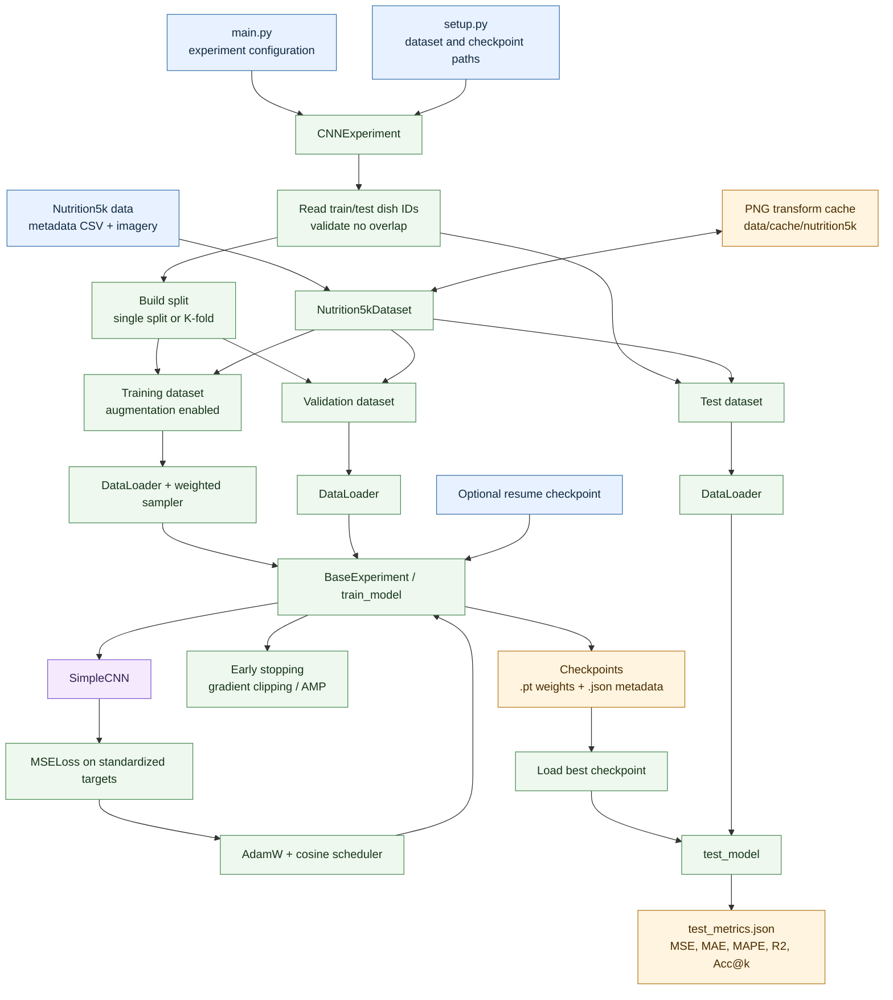
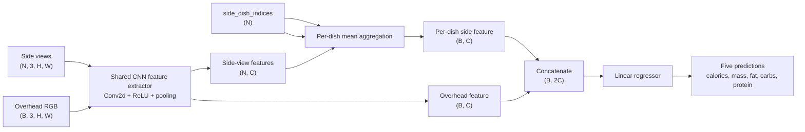

# Nutrition5k comparison architecture

The diagram below shows the training and evaluation flow starting at
`main.py`. It reflects the current single-split default (`FOLDS = None`);
when folds are configured, the split branch repeats once per fold.

## Model data path

Each dish contributes one overhead image and zero or more side-angle images.
The custom collator flattens side images and records the owning dish index so
the model can aggregate them back into per-dish features.

## Persistent outputs

- `data/cache/nutrition5k/*.png`: transformed image cache entries.
- `checkpoints/simple_cnn/<timestamp>/<split>/simple_cnn_latest.pt`: latest
  training state.
- `checkpoints/simple_cnn/<timestamp>/<split>/simple_cnn_best.pt`: best
  validation checkpoint.
- Sibling `.json` files: readable checkpoint metadata and history.
- `test_metrics.json`: final test metrics for the selected checkpoint.
